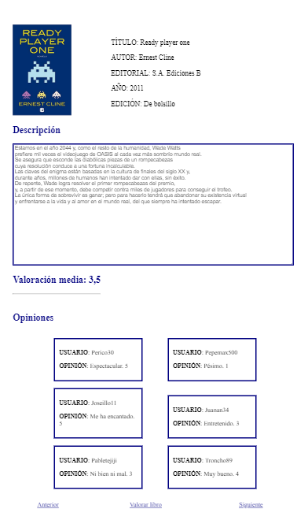
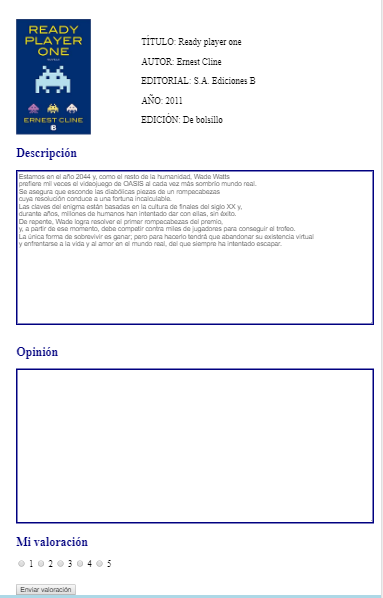
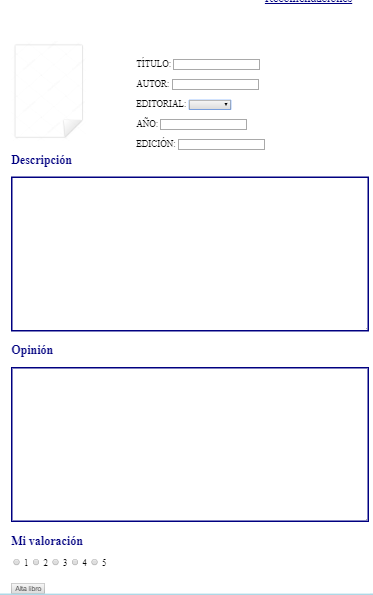
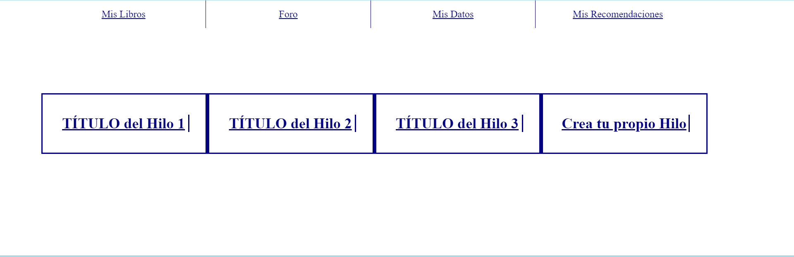
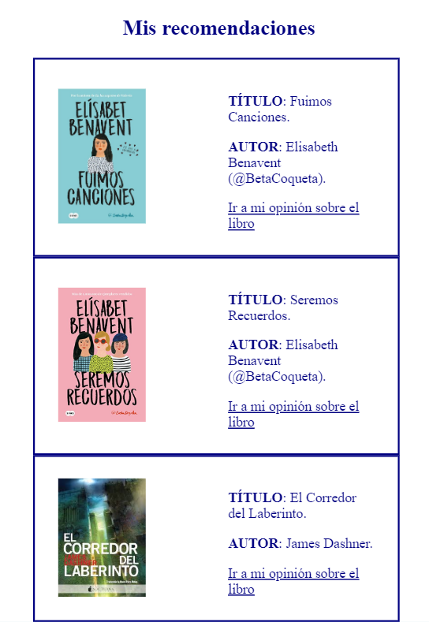
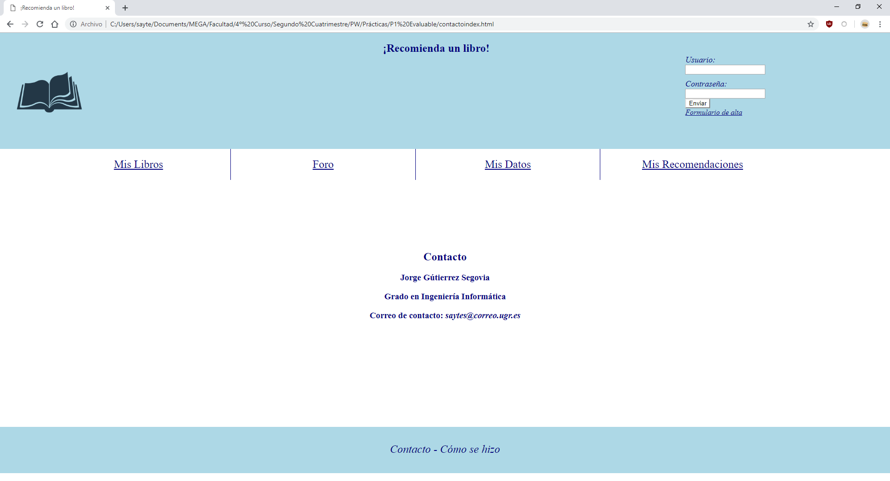

# CÓMO SE HIZO - ¡Recomienda un libro!


### Jorge Gutiérrez Segovia - 75930719Z - saytes@correo.ugr.es

---

### Índice

1. [Páginas de Inicio](#inicio)
2. [Mis Libros](#mislibros)
   1. [Libro leído](#libroleido)
   2. [Nuevo libro](#nuevolibro)
   3. [Alta de un nuevo libro](#altalibro)
3. [Foro](#foro)
   1. [Hilo](#hilo)
   2. [Nuevo Hilo](#altahilo)
4. [Formulario de Alta de usuario y Mis Datos](#altausuario).
5. [Mis Recomendaciones](#recomendaciones)
6. [Pie de página](#footer)
   1. [Contacto](#contacto)
7. [Estilo](#css)

### Desarrollo de la práctica

---

#### 1. Páginas de Inicio<a name="inicio"></a>

La práctica ha sido diseñada hasta el punto del apartado "Mis libros" tal y como se exigía en la documentación.

Desglosando a grandes rasgos, mis páginas "index.html" y "index2.html" son idénticas teniendo tres excepciones.

**La primera excepción** es la sección con clase ***"inicioS"*** la cual es la que contiene el formulario para el inicio de sesión en la página "index.html" y en la página "index2.html" contiene un párrafo(p) con el nombre del usuario, un título que indica que se está conectado y un botón para cerrar sesión.

**La segunda excepción** es la barra de navegación, la cual  no está disponible en "index.html" ya que sólo se muestra si estás conectado.

**La tercera excepción** es que el logo de la página es un enlace a "index2.html" en todas las páginas excepto en "index.html", en la cual no hace nada ya que sería absurdo en fuese a si misma solamente.

El resultado final será:

- ***Para Index.html :***


- ***Para Index2.html :***


Aparte de esto, en ambas se mostrarán 3 libros que serán los mejor valorados a la derecha y a la izquierda se mostrará una imagen relacionada con la página web.

A partir de esta página, todas compartirán la cabecera de index2.html, mientras que el pie de página será el mismo para todas.

---

#### 2. Mis Libros<a name="mislibros"></a>

Mis libros contendrá, a la izquierda una lista con los libros leídos por el usuario y a la derecha títulos sobre los últimos libros añadidos, dando también la opción de añadir un nuevo libro.


##### 2.1 Libro leído<a name="libroleido"></a>

Haciendo clic en el título de cualquiera de los libros leídos, este nos llevará a un página dónde estará la valoración, que no se puede editar, que le dimos a ese libro.

En este caso, la imagen está realizada para el diseño adaptable, en una pantalla con 768 de ancho para poder apreciarla mejor en la documentación, aunque su diseño también está disponible para una pantalla con 1920 de ancho.


##### 2.2 Nuevo libro<a name="nuevolibro"></a>

Si por el contrario, en la página *"Mis libros.html"* hacemos clic en un libro nuevo, nos llevará a una página distinta, que contiene la descripción de este libro, una valoración media y una lista de opiniones externas.

En este caso, las imágenes están realizadas para el diseño adaptable, en una pantalla con 768 de ancho para poder apreciarla mejor en la documentación, aunque su diseño también está disponible para una pantalla con 1920 de ancho.



También tendremos la opción de valorarlo nosotros haciendo clic en *"Valorar libro"*, el cual nos dejará rellenar una opinión y seleccionar una valoración del 1 al 5.



##### 2.5 Alta de un nuevo libro<a name="altalibro"></a>

Por último, si seleccionamos dar de alta un nuevo libro nos saldrá una página nueva, la cual nos dejará insertar un nuevo libro en la página.

En este caso, la imagen está realizada para el diseño adaptable, en una pantalla con 768 de ancho para poder apreciarla mejor en la documentación, aunque su diseño también está disponible para una pantalla con 1920 de ancho.




---

#### 3. Foro<a name="foro"></a>

El Foro será una página de invención propia que contendrá un enlace a los diversos hilos de la web, y dejará crear un hilo nuevo.





##### 3.1 Hilo<a name="hilo"></a>

Si hacemos clic en el título de cualquier hilo, este nos llevará a la página del hilo, la cual será la siguiente.


##### 3.2 Nuevo hilo<a name="altahilo"></a>

Por último, si hacemos clic en *"Crea tu propio Hilo"*, nos saldrá un formulario para crear un hilo nuevo que tendrá la estructura similar a la página de un Hilo cualquiera.


Ambas páginas disponen de un botón con la función de volver al foro , y otro que permitirá responder en un hilo cualquiera, y publicar el nuevo hilo en la página de creación de un hilo nuevo.

---

#### 4. Formulario de Alta de usuario y Mis Datos<a name="altausuario"></a>

Si en la página principal, sin haber iniciado sesión, hacemos clic en formulario de alta, este nos llevará a la página de alta de usuario, que será la misma que la página Mis datos, con la única excepción de que en "misdatos.html" el formulario saldrá completo directamente y podremos cambiar los datos que ya había.

- ***Para altausuario.html :***


- ***Para misdatos.html :***


---

#### 5. Mis Recomendaciones<a name="recomendaciones"></a>

En la página de Mis recomendaciones saldrán los libros que el usuario recomienda, con enlaces a las opiniones del usuario de ese mismo libro, llevando a las páginas libroleido1.html, libroleido2.html o libroleido3.html dependiendo del libro que se seleccione.

En este caso, la imagen está realizada para el diseño adaptable, en una pantalla con 768 de ancho para poder apreciarla mejor en la documentación, aunque su diseño también está disponible para una pantalla con 1920 de ancho.



---

#### 6. Pie de página<a name="footer"></a>

El pie de página o footer contendrá un enlace a esta documentación y otro a la página de contacto.


##### 6.1 Contacto<a name="contacto"></a>

La página *"contacto.html"* contendrá simplemente cuatro títulos, que no varían nunca,  aunque  esta página tiene una excepción , la cual será que está diseñada dos veces, siendo la otra *"contactoindex.html"* que será la página que se visitará como contacto únicamente cuando se haga clic a contacto desde la página principal sin haber iniciado sesión *"index.html"*.

- ***Para "contacto.html"***


- ***Para "contactoindex.html"***



---

#### 7. Estilo<a name="css"></a>

El estilo de mis páginas está desarrollado dentro del archivo llamado *"estilo.css"*.

Este archivo contiene la configuración necesaria para el estilo de todas las páginas de mi proyecto en un monitor con resolución 1920x1080 y aparte tiene un desarrollo de web adaptable para una pantalla con ancho de 768 píxeles.

El estilo de las diversas páginas está separado de la siguiente página por un comentario como este:

`/********************INDEX*******************/`

Excepto en el diseño adaptable, el cuál estará separado así:

`/* INDEX */`


En el código, todo el estilo va configurándose a raíz de clases, nombradas en los archivos HTML.

Por ejemplo, para el estilo de la cabecera, en concreto del logo, será el siguiente:

Su ***HTML*** contendrá una sección que tendrá una clase con nombre *logo*.

```html
<section class="logo">
            <a href="index2.html"> </a>
</section>
```


Y su estilo será :

```css
.logo{
	width: 30%;
	float: left;
	margin-left: 1%;
	margin-top: 3%;
	margin-bottom: 3%;
}
```

